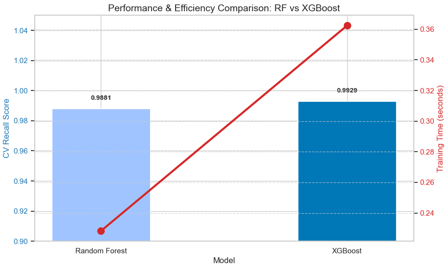
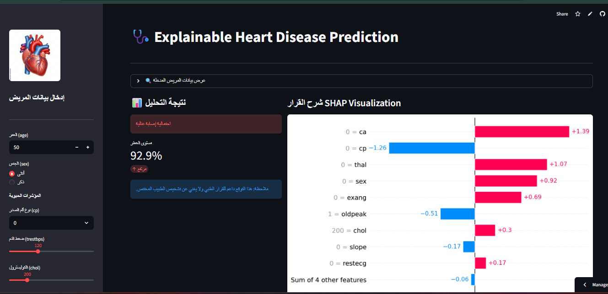
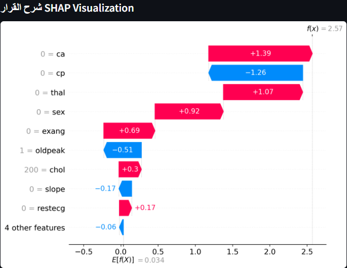

# 🩺 Explainable AI for Heart Disease Prediction

[](https://projectheart-xai-iyfmcpr2yk48zhxr8s6xy5.streamlit.app)


## 📝 Abstract
In the clinical sector, high-performance machine learning models are often hindered by their **"Black-Box"** nature. Physicians frequently struggle to trust automated diagnoses that lack logical justification. This project bridges the gap between predictive power and clinical trust by delivering a high-accuracy system powered by **Explainable AI (XAI)** techniques.


---

## 🚀 Core Technologies

### **1. XGBoost (Extreme Gradient Boosting)**
**XGBoost** is an optimized distributed gradient boosting library designed to be highly efficient and flexible. In this project, it serves as the primary diagnostic engine, utilizing a framework that builds decision trees sequentially to minimize errors from previous iterations, ensuring maximum precision in identifying heart disease.

### **2. Random Forest (RF)**
**Random Forest** is an ensemble learning method that operates by constructing a multitude of decision trees during training. It was used in this study as a robust baseline to validate the performance of XGBoost, ensuring the final model meets the highest standards of reliability.

### **3. SHAP (SHapley Additive exPlanations)**
**SHAP** is a game-theoretic approach used to explain the output of any machine learning model. By assigning each physiological feature an importance value (Shapley value), it provides transparency into **why** a specific patient was flagged as high-risk, identifying key drivers like blood pressure or cholesterol levels.

---

## 🌟 Key Features
- **High-Accuracy Diagnostics:** Leverages fine-tuned **XGBoost** parameters for maximum clinical reliability.
- **Full Transparency (XAI):** Integrated **SHAP Waterfall plots** visualize the impact of every vital sign on the final decision.
- **Smart Clinical Reporting (Arabic/English):** Automatically translates complex visual data into simplified text summaries for rapid medical review.
- **Medical Documentation:** One-click generation of finalized medical reports ready for printing or digital filing.

---

## 📊 Benchmark Comparison: RF vs. XGBoost
We evaluated **Random Forest** against **XGBoost** based on accuracy and computational efficiency:

| Model | Recall (Sensitivity) | Training Time | Decision |
| :--- | :---: | :---: | :--- |
| **XGBoost** | **99.29%** | 0.36s | **Selected (Superior Accuracy)** |
| **Random Forest** | 98.81% | 0.24s | Baseline |



> **Why Recall?** In cardiology, missing a positive case (False Negative) is critical. XGBoost was chosen because its 99.29% Recall ensures nearly all heart disease cases are correctly identified.


---

## 🖥️ User Interface & Experience
The application is designed for medical professionals, featuring a clean, intuitive layout built with **Streamlit**.

### **1. Patient Data Entry**
The sidebar allows doctors to input vital signs and lab results efficiently.


### **2. Explaining the AI Logic (SHAP)**
Visualizing the underlying logic behind each prediction to build clinical trust.



### **3. Smart Analysis Report (Arabic)**
A unique feature that summarizes the risk factors in plain Arabic for quick decision-making.
> ⚠️ **مثال للتقرير:** "عامل الخطر الرئيسي لهذا المريض هو ضغط الدم المرتفع والعمر."

---

## 🛠️ Tech Stack
- **Language:** Python
- **Machine Learning:** XGBoost, Scikit-learn
- **Interpretability:** SHAP
- **Interface:** Streamlit
- **Visualization:** Matplotlib, Seaborn

## 📂 Project Structure
- `streamlit_app.py`: The main UI and logic handler.
- `model.pkl`: The pre-trained XGBoost diagnostic engine.
- `requirements.txt`: Necessary libraries for deployment.
- `images/`: Folder containing screenshots and UI assets.

---

## ⚙️ How to Run Locally
1. Clone the repository:
   ```bash
   git clone [https://github.com/YourUsername/ProjectName.git](https://github.com/YourUsername/ProjectName.git)


